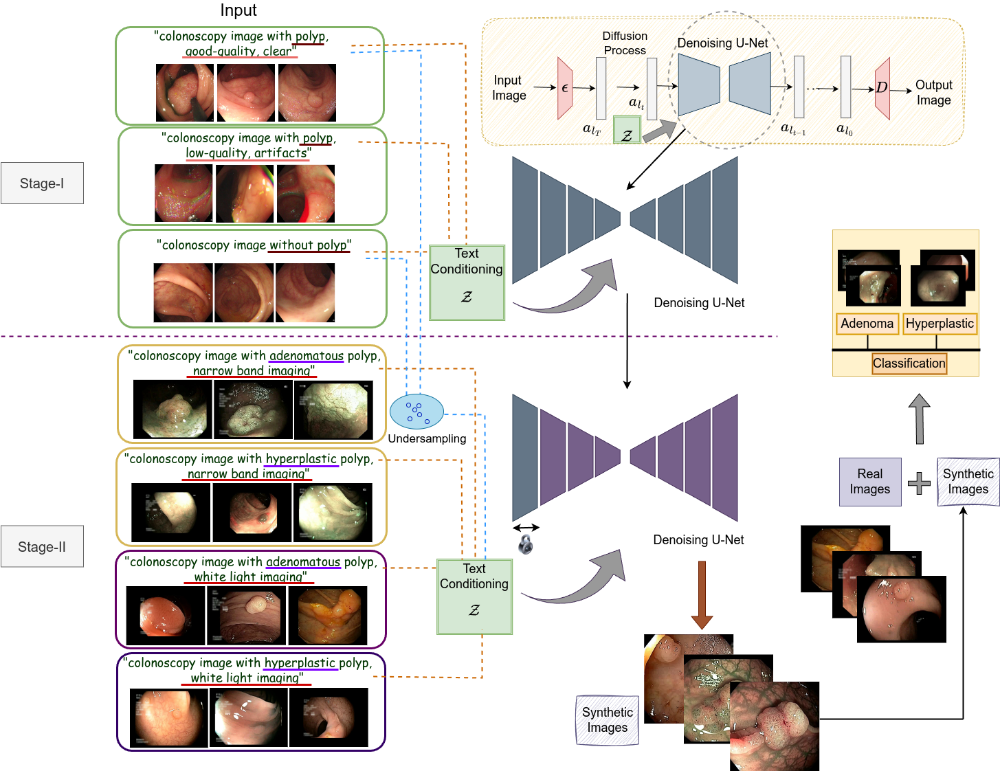

# PathoPolyp-Diff

Paper Link: [https://arxiv.org/pdf/2502.05444](https://arxiv.org/pdf/2502.05444)

## 1. Introduction

Pathologic diagnosis is a critical phase in deciding the optimal treatment procedure for dealing with colorectal cancer (CRC). Colonic polyps, precursors to CRC, can pathologically be classified into two major types: adenomatous (malignant potential) and hyperplastic (benign). For precise classification and early diagnosis of such polyps, the medical procedure of colonoscopy has been widely adopted paired with various imaging techniques, including narrow band imaging (NBI) and white light imaging (WLI). These imaging modalities have different advantages in capturing polyp-specific features for accurate classification. However, the existing classification techniques mainly rely on a single imaging modality and show limited performance due to data scarcity. Recently, generative artificial intelligence has been gaining prominence in overcoming such issues. Additionally, various generation-controlling mechanisms using text prompts and images have been introduced to obtain visually appealing and desired outcomes in a better-controlled manner. However, such mechanisms require class labels to make the model respond efficiently to the provided control input. In the colonoscopy domain, such controlling mechanisms are rarely explored; specifically, the text prompt is a completely uninvestigated area. Moreover, the unavailability of expensive class-wise labels for diverse sets of images limits such explorations. Therefore, in this work, we develop a novel model, ***PathoPolyp-Diff***, that generates text-controlled synthetic images with diverse characteristics in terms of pathology, imaging modalities, and quality. In the process, we introduce cross-class label learning to make the model learn features from other classes, reducing the burdensome task of data annotation. We validate the effectiveness of text-controlled synthesis and cross-class label learning by performing polyp classification (adenomatous/hyperplastic) with different imaging modalities (NBI/WLI) and text prompts. The experimental results report an improvement of up to 7.91% in balanced accuracy using a publicly available dataset. Moreover, cross-class label learning achieves a statistically significant improvement of up to 18.33% in balanced accuracy during video-level analysis.

 

*Figure 1: Overview of the proposed framework. It consists of two stages and uses various text conditioning to control the generation process. In Stage-II, some undersampled data from Stage-I is used for a smoother learning process. Also, the first block of U-Net is kept locked in the second stage. The performance of the proposed model is validated using a classification process which uses a combination of real and synthetic images in different proportions.*

This repository will be updated soon!
